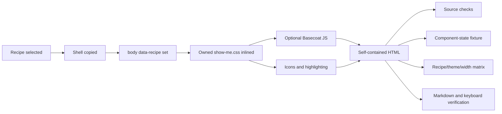

## Summary

Replace the Basecoat/shadcn visual layer with an owned CSS system while preserving the existing single-file delivery model, component markup, required Basecoat JavaScript, three-state theme switch, Markdown export, and all reader-task recipes. The redesign will give each of the 20 recipes a recognizable structural fingerprint instead of treating them as color variations of one document template.

---

## Problem frame

`show-me-html` is reliable as a technical-document renderer, but its visual identity is split between `assets/shell.html` and eight Basecoat CSS bundles. The current recipes define section order and interactions, not enforceable visual identities, so outputs remain visually similar even when their reader jobs differ. The bundled Basecoat styles also retain generic shadcn traits such as broad `transition-all` rules.

The redesign must improve hierarchy and variety without regressing the behaviors hardened in the September 2026 shell repairs: theme initialization, print behavior, TOC tracking, Markdown conversion, nested-list export, native-control styling, focus visibility, reduced motion, grid safety, and attachment-size warnings.

---

## Requirements

- **R1. Owned visual layer.** Production pages must receive their visual tokens, themes, base rules, component appearance, and recipe fingerprints from a stylesheet owned by `show-me-html`, not a Basecoat CSS bundle.
- **R2. Behavioral compatibility.** Existing component class names, DOM structure, `data-*` variants, ARIA relationships, toolbar, TOC, Markdown exporter, Lucide inlining, syntax highlighting, and required Basecoat JavaScript must continue to work.
- **R3. Theme parity.** Light, dark, and system modes must cover every semantic surface and interactive state without flashes, unreadable states, or print regressions.
- **R4. Recipe identity.** All 20 recipes must declare a stable recipe hook and differ through geometry, hierarchy, density, section rhythm, or signature surfaces. Color-only differentiation does not satisfy this requirement. Each recipe also defines a reader loop: orientation, evidence or manipulation, then decision, action, or export where the task calls for it.
- **R5. Interaction discipline.** Replace `transition-all`; focus rings appear immediately; overshoot easing is limited to physical drag release; eyebrow labels default off and are capped where genuinely ordinal. Do not use hover-only disclosure, non-semantic clickable containers, or drag without a keyboard alternative.
- **R6. Responsive safety.** Outputs must avoid horizontal overflow and broken controls at the existing automated widths and the manually verified 390px width. Clickable labels remain single-line or reflow as whole controls. Fixed viewports, wide diagrams, multi-lane boards, sticky toolbars/rails, tables, and long mono identifiers receive explicit narrow-screen checks.
- **R7. Honest, bounded styling.** Preserve token-only page styling, factual-content rules, no invented metrics, no duplicate export control, and no unnecessary decorative sections. Upstream examples use disclosed fictional data; that does not permit generated status metrics, estimates, paths, test claims, or operational facts without source evidence.
- **R8. Regression harness.** Build behavior, component states, recipe fingerprints, themes, export, and representative interactions must have repeatable fixtures or tests. Interactive fixtures use fixed or seeded state so reset produces identical DOM and output. The five frozen scenarios remain unchanged.
- **R9. Delivery size.** Removing Basecoat CSS must not be replaced by an equally large owned bundle. Existing 400KB, 1MB, and 3MB warning tiers remain in force; representative outputs must be compared against the pre-redesign baseline.
- **R10. Font policy.** Retain the user-approved asynchronous Google Fonts loading with complete local fallbacks. Documentation must describe the result accurately as offline-readable, not appearance-identical offline.
- **R11. Traceable inspiration.** Borrow reader mechanics and structural grammar from `anthropics/html-effectiveness` at audited commit `58c305be97f47b26b678f2c07dec01d4242268ec`, not its exact palette, typography treatment, duplicated per-file code, or accessibility gaps. Every adopted mechanism must identify its upstream evidence, local adaptation, and rejected aspects.

---

## Scope boundaries

- Do not redesign the material-gathering, recipe-dispatch, or content-honesty workflow.
- Do not change the canonical Markdown conversion behavior or add another export button.
- Do not replace Basecoat JavaScript in this redesign; retain it only for components that already require it.
- Do not change existing component markup merely to make CSS easier. Add only a root recipe hook and narrowly justified state hooks.
- Do not rewrite the five frozen scenario inputs. New deterministic fixtures and new scenario files must be additive.
- Do not add a frontend framework, build system, browser automation dependency, or runtime network dependency beyond the retained Google Fonts exception.
- Do not retrofit historical HTML files. Generated pages keep the shell and styles embedded at generation time.
- Remove the eight-style `--style` model rather than maintaining two competing visual systems.
- Do not vendor, iframe, or mechanically copy the upstream `html-effectiveness` templates. Keep the research note and commit link as evidence; implement the resulting contracts in owned shared CSS and existing recipe markup.

### Deferred to follow-up work

- Replacing Basecoat JavaScript with owned interaction code.
- Making offline typography appearance-identical through embedded font files.
- Introducing repository-wide CI beyond a focused, locally runnable `show-me-html` test entry point.

---

## Context and research

### Relevant code and patterns

- `skills/show-me-html/assets/shell.html` owns theme bootstrapping, token definitions, page layout, chrome, print rules, TOC, Markdown export, and interaction helpers.
- `skills/show-me-html/scripts/build.py` selects and inlines Basecoat CSS, conditionally inlines Basecoat JS and syntax highlighting, extracts icons, runs source checks, and probes horizontal overflow.
- `skills/show-me-html/references/components.md` is the public component markup and token contract. Existing examples must remain valid.
- `skills/show-me-html/references/layouts.md` defines the 20 task-oriented recipe grammars. It is the right place to declare recipe-specific fingerprints.
- `skills/show-me-html/MAINTENANCE.md` requires harness defects to be fixed centrally and shell/build changes to run frozen scenarios before and after.
- `skills/show-me-html/scenarios/README.md` provides five frozen representative scenarios but leaves 15 recipes without direct coverage.
- `skills/show-me-html/references/anti-patterns.md` records three historical failures: statistic-orphan headings, double-title Markdown export, and implicit-grid overflow.

### Institutional learnings

- The shell is a behavioral contract, not just a visual template.
- Commits `b818178`, `e5c21a1`, and `ac8d6c2` fixed failures that must survive the CSS move: dark printing, details export duplication, headerless tables, nested Markdown lists, TOC layout churn, reduced motion, focus rings, and grid-check false negatives.
- The repository has no `docs/solutions/` material and no checked-in historical visual round outputs.
- Repository files are the source of truth; installed copies previously drifted. Sync remains repo-to-install followed by a directory diff.

### External research

Audited the complete first-party `anthropics/html-effectiveness` gallery at commit `58c305be97f47b26b678f2c07dec01d4242268ec`: `README.md`, `index.html`, and all 20 numbered standalone templates. The detailed inventory is in `docs/research/2026-09-01-html-effectiveness-template-assessment.md`.

The upstream gallery confirms that one restrained visual language can support distinct reader jobs when macrostructure changes: judgment grids, evidence ledgers, execution spines, specimen fields, dominant live stages, viewport slides, model/detail rails, and direct-manipulation workspaces. Its strongest reusable pattern is orientation followed by spatial evidence or manipulation, ending in a decision, action, or portable result.

The audit also sets a firm non-copy boundary. The examples repeat exact ivory/clay/oat/olive tokens and serif/mono/uppercase treatments, duplicate CSS and JavaScript per file, have incomplete theme/print/reduced-motion support, include mouse-only or hover-only interactions, and use `innerHTML` in templates `13`, `15`, and `18` through `20`. These are reference implementations, not a production accessibility or rendering contract.

### Research limitation

The delegated flow-analysis stage did not run because the original orchestration workflow timed out after both repository research tasks completed. The later template audit covered source structure only. It did not run the upstream pages in a browser or verify contrast, keyboard operation, print, or narrow viewports. Those observations remain hypotheses until the implementation's browser fixtures exercise the adapted patterns.

---

## Key technical decisions

- **Keep semantic markup and behavior, own the visual CSS.** This preserves stable accessibility and interaction contracts without carrying the Basecoat visual voice.
- **Use one CSS asset with layered ownership.** The owned file contains foundations, themes, base elements, components, utilities, and recipe fingerprints in an explicit cascade order. Avoid a collection of loosely ordered override files.
- **Preserve compatibility aliases during migration.** Existing page-authored CSS consumes `--color-*`, `--chart-*`, `--tone-*`, `--syn-*`, `--radius`, `--font-*`, and `--ease-*`; the new token layer defines these directly before Basecoat CSS is removed.
- **Use a root recipe hook.** Generated pages declare `data-recipe="<name>"` on the body. Recipe selectors may also support nested fixture containers, enabling one deterministic gallery to exercise the full matrix.
- **Use family foundations plus recipe signatures.** Related recipes can share base density or composition rules, but each recipe gets at least one unique structural move. Twenty unrelated mini-themes would be harder to maintain and would weaken project coherence.
- **Borrow mechanics, not branding.** Use the upstream gallery as evidence for task-shaped composition, visible evidence, annotation, and bounded interaction. Do not reproduce its exact palette, type pairing, eyebrow treatment, or per-template styling.
- **Prefer native interaction primitives.** Start with `details`, labeled inputs, buttons, anchors, tables, lists, and semantic SVG. Custom tabs, selected-item detail rails, contenteditable editors, and reorder controls must add keyboard behavior and explicit focus states.
- **Render generated text safely.** Selected-node details, editor previews, diffs, and model readouts use `textContent`, DOM construction, or a narrowly scoped escaped fragment path. Upstream `innerHTML` examples are not copied.
- **Remove `--style`.** The eight Basecoat style packs conflict with an owned design system. The CLI, README, skill instructions, and vendor files move together so there is one authoritative path.
- **Retain Google Fonts asynchronous fallback.** This is an explicit user decision. The page remains readable offline, but exact typography is not guaranteed offline.
- **Keep CSS motion narrow.** Use explicit transition properties. Non-physical UI state uses restrained exponential easing; spring easing survives only for drag release or another interaction that represents physical momentum.
- **Make recipe identity mechanically visible.** `build.py` validates the recipe name and required root hook; tests verify all recipe names have CSS coverage and fixture coverage.

---

## High-level technical design

> This illustrates the intended approach and is directional guidance for review, not implementation specification. The implementing agent should treat it as context, not code to reproduce.

Owned CSS cascade, from lowest to highest responsibility:

1. foundation and compatibility tokens;
2. light/dark semantic themes;
3. reset and document typography;
4. component structure and state styling;
5. layout utilities and diagram primitives;
6. recipe-family foundations;
7. individual recipe signatures;
8. print and reduced-motion overrides.

### Recipe families and signatures

| Family                  | Recipes                                                                    | Shared posture             | Required recipe distinction                                                          |
| ----------------------- | -------------------------------------------------------------------------- | -------------------------- | ------------------------------------------------------------------------------------ |
| Decisions               | `approach-compare`, `visual-directions`                                    | side-by-side judgment      | comparison matrix vs. rendered specimen field                                        |
| Code and reference      | `code-review`, `pr-writeup`, `code-understanding`, `design-system-ref`     | dense evidence             | diff ledger, editorial narrative, numbered execution spine, specimen/reference split |
| Prototypes              | `component-variants`, `animation-proto`, `interaction-proto`               | dominant live stage        | control rail, timeline/easing trace, state monitor                                   |
| Reports and plans       | `status-report`, `incident-report`, `implementation-plan`, `slide-deck`    | scan-first hierarchy       | KPI band, chronological spine, dependency bands, viewport panels                     |
| Explainers and diagrams | `flowchart`, `svg-illustrations`, `feature-explainer`, `concept-explainer` | visual model before detail | selected-node detail, gallery plates, demo/API split, model laboratory               |
| Editors                 | `triage-board`, `config-editor`, `text-tuner`                              | direct manipulation        | lane geometry, settings/change rail, editor/preview split                            |

### Upstream template adaptation matrix

Each row turns an upstream example into a local recipe contract. The last column is as important as the borrowed pattern.

| Local recipe          | Upstream evidence                     | Borrow into `show-me-html`                                                    | Adapt or reject                                                                                       |
| --------------------- | ------------------------------------- | ----------------------------------------------------------------------------- | ----------------------------------------------------------------------------------------------------- |
| `approach-compare`    | `01-exploration-code-approaches.html` | numbered comparison columns, evidence chips, explicit recommendation          | stack cleanly on narrow screens; do not force equal-height filler                                     |
| `visual-directions`   | `02-exploration-visual-designs.html`  | rendered artboards with rationale, not abstract option cards                  | use the global theme contract; keep native radios focusable                                           |
| `code-review`         | `03-code-review-pr.html`              | risk map, annotated diff ledger, collapsed low-risk files, next steps         | preserve semantic disclosure and keyboard jump targets                                                |
| `code-understanding`  | `04-code-understanding.html`          | execution path, numbered call-stack spine, key-files/gotchas rail             | selected detail must use safe text rendering and collapse below content on mobile                     |
| `design-system-ref`   | `05-design-system.html`               | specimen-led color, type, spacing, shape, and component sections              | show owned semantic tokens in both themes; do not copy the upstream brand palette                     |
| `component-variants`  | `06-component-variants.html`          | dominant variant matrix, control rail, implementation readout                 | controls remain semantic and keyboard reachable; no hover-only output                                 |
| `animation-proto`     | `07-prototype-animation.html`         | live stage, easing controls, timing track, copyable CSS                       | reduced motion is mandatory; spring and celebration effects stay bounded                              |
| `interaction-proto`   | `08-prototype-interaction.html`       | isolated workbench beside decision notes and open questions                   | provide a keyboard path for reorder/manipulation and document intentionally omitted behavior          |
| `slide-deck`          | `09-slide-deck.html`                  | content-specific viewport panels, counter, arrow/space navigation             | use dynamic viewport units and content overflow fallbacks; reduced motion disables smooth scrolling   |
| `svg-illustrations`   | `10-svg-illustrations.html`           | large gallery plates, captions, palette/rules appendix                        | keep the existing global Markdown export boundary; per-SVG download remains out of scope              |
| `status-report`       | `11-status-report.html`               | KPI band, highlights, shipped evidence, chart, carryover                      | render only sourced metrics; no fictional "auto-generated" claims                                     |
| `incident-report`     | `12-incident-report.html`             | severity metadata, TL;DR, timeline, cause, impact, actions                    | sticky TOC must not collide at narrow widths; print remains first-class                               |
| `flowchart`           | `13-flowchart-diagram.html`           | large canvas, selected-node detail rail, legend                               | diagram nodes are semantic controls; never copy its `innerHTML` update path                           |
| `feature-explainer`   | `14-research-feature-explainer.html`  | request path, configuration example, gotchas, FAQ disclosure                  | tabs must implement full tab semantics or use native disclosure instead                               |
| `concept-explainer`   | `15-research-concept-explainer.html`  | model laboratory first, comparison table, glossary/context rail               | deterministic model state, keyboard linkage, safe DOM updates; no hover-only glossary                 |
| `implementation-plan` | `16-implementation-plan.html`         | summary strip, milestone spine, data flow, mockups, key code, risks/questions | omit mockups, estimates, or diagrams when source evidence is absent; wide SVGs need a mobile strategy |
| `pr-writeup`          | `17-pr-writeup.html`                  | why, before/after, reading-order file tour, review focus, tests, rollout      | keep author perspective distinct from review; claims must trace to the diff or test evidence          |
| `triage-board`        | `18-editor-triage-board.html`         | semantic lanes, counts, filtering, reorder, portable state                    | add keyboard reorder and deterministic reset; use safe DOM construction                               |
| `config-editor`       | `19-editor-feature-flags.html`        | settings list, dependency validation, pending-change/diff rail                | serialize authoritative state without unsafe HTML or duplicate global export controls                 |
| `text-tuner`          | `20-editor-prompt-tuner.html`         | editor/preview split, variable legend, live samples, slot validation          | preserve caret and newlines with plain-text state; replace `innerHTML` rendering                      |

Every recipe entry in `references/layouts.md` must record five fields: opening frame, primary evidence surface, detail mechanism, terminal action, and mobile collapse. A recipe may explicitly declare "none" for interaction or action rather than invent one.

---

## Implementation units

### U1. Freeze the behavioral and visual baseline

**Goal:** Establish evidence that distinguishes intended redesign changes from regressions.

**Requirements:** R2, R3, R6, R8, R9, R11

**Dependencies:** None

**Files:**

- Modify: `skills/show-me-html/MAINTENANCE.md`
- Modify: `skills/show-me-html/scenarios/README.md`
- Create: `skills/show-me-html/references/visual-system.md`
- Reference: `docs/research/2026-09-01-html-effectiveness-template-assessment.md`

**Approach:**

- Generate the five existing frozen scenarios from the pre-change SHA and retain their round artifacts outside git under the established `scenarios/rounds/` convention.
- Record light/dark screenshots, 500/1280 overflow results, manual 390 review, Markdown output, console state, page size, and build warnings.
- In `references/visual-system.md`, define the chosen visual direction, semantic token roles, typography roles, spacing rhythm, component state matrix, motion policy, responsive rules, and the family/recipe fingerprint matrix.
- Record the upstream adaptation rule in the visual spec: copy no exact palette or template CSS; trace each adopted reader mechanic to the audited commit and state what was changed for theme, accessibility, responsive behavior, and factual integrity.
- Before component implementation, review a compact style-board artifact that demonstrates typography, palette, card treatment, controls, code, table, and both themes. Include silhouettes for a judgment grid, evidence ledger, live stage, timeline, model/detail rail, and editor workspace. Record one selected direction rather than preserving several alternatives.

**Patterns to follow:**

- Regression-round procedure in `skills/show-me-html/scenarios/README.md`.
- Central-fix routing in `skills/show-me-html/MAINTENANCE.md`.

**Test scenarios:**

- Baseline: each frozen scenario builds with zero errors and its current warnings are recorded.
- Theme: each scenario renders in light and dark without unresolved console errors.
- Export: representative tables, details, tabs, and skipped controls export correctly before changes.
- Size: generated byte sizes are captured for later comparison.

**Verification:**

- A reviewer can compare every later validation result against a named pre-change artifact and the visual-system spec contains one selected direction.

---

### U2. Add a focused test harness before changing the build seam

**Goal:** Protect the compiler/checker contract before replacing its CSS input.

**Requirements:** R2, R4, R6, R8, R9

**Dependencies:** U1

**Files:**

- Create: `skills/show-me-html/tests/test_build.py`
- Create: `skills/show-me-html/tests/fixtures/minimal-shell.html`
- Create: `skills/show-me-html/tests/fixtures/component-states.html`
- Create: `skills/show-me-html/tests/fixtures/recipe-matrix.html`
- Modify: `skills/show-me-html/scripts/build.py`
- Modify: `skills/show-me-html/README.md`

**Approach:**

- Use Python's standard `unittest` facilities; do not add a test dependency.
- Cover CSS/JS/icon/highlight insertion, second-run idempotence, source checks, invalid recipe names, required token/marker presence, and preservation of the optional Basecoat JS path.
- Build a single component-state fixture that contains every documented component and meaningful state, including tabs, diagram-node controls, contenteditable state, and keyboard reorder controls.
- Build a deterministic recipe matrix using the same 20-name allow-list as validation. Keep it independent of model-generated scenario prose; reset must reproduce identical DOM, ordering, and exported output.
- Expose a documented local test entry point without broadening repository CI in this unit.

**Patterns to follow:**

- Existing pure-standard-library implementation in `skills/show-me-html/scripts/build.py`.
- Frozen scenarios remain higher-level acceptance coverage rather than unit-test fixtures.

**Test scenarios:**

- Happy path: a fresh shell receives one owned CSS marker, only required JS, requested icons, and requested highlighters.
- Idempotence: a second build does not duplicate CSS, JS, icons, or highlighting.
- Edge case: a page with no JS component does not receive Basecoat JS.
- Edge case: tabs or dropdown markup receives Basecoat JS and keeps its ARIA wiring.
- Error path: an unknown or missing recipe value fails clearly.
- Error path: a missing CSS slot and missing inlined marker fails clearly.
- Integration: `--check-only` validates a previously built page without mutating it.

**Verification:**

- The new tests pass against the current pipeline before the CSS cutover, apart from assertions intentionally staged for the owned CSS path.

---

### U3. Implement owned tokens, themes, typography, and motion

**Goal:** Create the new visual foundation without yet deleting Basecoat CSS.

**Requirements:** R1, R3, R5, R6, R9, R10

**Dependencies:** U1, U2

**Files:**

- Create: `skills/show-me-html/assets/show-me.css`
- Modify: `skills/show-me-html/assets/shell.html`
- Modify: `skills/show-me-html/references/visual-system.md`
- Modify: `skills/show-me-html/references/components.md`
- Test: `skills/show-me-html/tests/test_build.py`
- Test: `skills/show-me-html/tests/fixtures/component-states.html`

**Approach:**

- Define all semantic tokens and current compatibility aliases in the owned file.
- Construct light and dark themes from perceptually controlled values, with explicit tokens for canvas, raised surfaces, text levels, rules, focus, states, charts, syntax, and category tones.
- Preserve the asynchronous Google Fonts links and robust local stacks. Update type roles and sizing without bypassing font tokens.
- Replace the global spring default and broad transitions with the approved motion policy.
- Add responsive defaults for long identifiers, grid children, single-line clickable labels, mobile section headings, wide SVGs/tables, sticky-region collisions, multi-lane boards, and control rails.
- Use dynamic viewport units with content-overflow fallbacks for slide-like layouts; never rely on fixed `100vh` as the only sizing rule.
- Require an owned focus-visible treatment whenever native appearance or outline is suppressed.
- Keep print and reduced-motion rules as first-class theme outputs, not late overrides copied from the old shell.

**Test scenarios:**

- Theme: every semantic token used by components resolves in light and dark.
- Theme: system mode follows both simulated light and dark preferences without initial flash.
- Accessibility: focus-visible rings are immediate and distinguishable on every surface.
- Motion: reduced-motion removes spatial movement; ordinary state changes do not overshoot.
- Typography: failed Google Fonts loading still leaves complete local stacks ending in generic families.
- Print: dark-mode pages print with dark text on light paper.

**Verification:**

- The style-board and component-state fixture display the approved direction in both themes, with no unresolved token or font-stack checks.

---

### U4. Rebuild component appearance against the preserved markup contract

**Goal:** Achieve state-complete visual parity for the documented component inventory while removing the generic shadcn voice.

**Requirements:** R1, R2, R3, R5, R6, R7

**Dependencies:** U3

**Files:**

- Modify: `skills/show-me-html/assets/show-me.css`
- Modify: `skills/show-me-html/references/components.md`
- Modify: `skills/show-me-html/references/interactions.md`
- Modify when token mapping requires it: `skills/show-me-html/references/diagrams.md`
- Test: `skills/show-me-html/tests/fixtures/component-states.html`
- Test: `skills/show-me-html/tests/test_build.py`

**Approach:**

- Style the exact existing structures for buttons, button groups, cards, badges, alerts, tables, items, accordions, tabs, dropdowns, dialogs, form controls, code, progress, skeletons, breadcrumbs, avatars, and empty states.
- Add shared visual/state contracts for selected-item detail rails, stage/control rails, semantic diagram nodes, contenteditable editors, and reorder alternatives without changing the canonical component markup unnecessarily.
- Cover default, hover, focus-visible, active, disabled, invalid/error, selected/open/checked, loading, and success where each component can meaningfully enter the state.
- Remove `transition-all`, animated focus rings, decorative hover scaling, excessive pills, card nesting, and mono-uppercase labels used as decoration.
- Preserve Basecoat JS state selectors such as ARIA selection/expansion and popover visibility.
- Keep components visually quiet enough that recipe geometry, not card decoration, carries the page identity.

**Test scenarios:**

- Keyboard: every interactive fixture is reachable and retains visible focus.
- State: tabs, menus, dialogs, switches, checkboxes, inputs, range controls, and details show distinct open/selected/checked/invalid states.
- Touch: hover-only information remains available by focus or click.
- Theme: state meaning remains legible in both themes and on category-tone surfaces.
- Responsive: controls and labels do not overflow or wrap into broken affordances at 390px.
- Integration: Basecoat JS-driven components remain behaviorally functional with the owned CSS.

**Verification:**

- The component-state fixture has no unstyled native controls, missing focus states, broad transitions, or Basecoat CSS dependency.

---

### U5. Cut the build pipeline over to the owned CSS

**Goal:** Make the owned stylesheet the only production visual source and remove the obsolete style-pack interface.

**Requirements:** R1, R2, R4, R8, R9

**Dependencies:** U4

**Files:**

- Modify: `skills/show-me-html/scripts/build.py`
- Modify: `skills/show-me-html/assets/shell.html`
- Modify: `skills/show-me-html/README.md`
- Modify: `skills/show-me-html/SKILL.md`
- Modify: `skills/show-me-html/agents/openai.yaml`
- Test: `skills/show-me-html/tests/test_build.py`

**Approach:**

- Replace `STYLES` and style-bundle lookup with one owned CSS asset.
- Preserve `<!--SHOW-ME:CSS-->`, `data-show-me="css"`, idempotence, icon extraction, optional Basecoat JS, and selective syntax highlighting.
- Add the 20-recipe allow-list and require a body recipe hook in fresh generated pages.
- Update hardcoded-color and native-control checks so they distinguish owned system CSS from page-authored CSS without hiding page mistakes.
- Add narrow source checks for generated/user content reaching unsafe HTML sinks, hidden native inputs without an accessible replacement, and clickable non-controls without keyboard semantics. Avoid blanket rules that reject static trusted SVG markup or framework-owned internals.
- Remove the `--style` CLI contract and all generated messages that report a Basecoat style.
- Keep size warnings and add a comparison note when a representative output grows relative to the recorded baseline.

**Test scenarios:**

- Happy path: fresh pages inline `show-me.css` exactly once.
- Compatibility: existing token-based page CSS still resolves after Basecoat CSS removal.
- Error path: missing recipe hook or unsupported recipe name blocks the build.
- Error path: legacy `--style` usage fails with concise migration guidance rather than silently choosing a style.
- Integration: tabs still trigger Basecoat JS; static pages do not.
- Integration: syntax highlighting, Lucide extraction, Markdown export, theme switching, TOC, print, and `--open` remain unchanged.

**Verification:**

- A repository search finds no production read path for Basecoat CSS or style-pack choices, while required Basecoat JS remains conditional.

---

### U6. Give all 20 recipes enforceable visual fingerprints

**Goal:** Make page structure visibly follow the reader's task while keeping one coherent system.

**Requirements:** R4, R5, R6, R7, R8, R11

**Dependencies:** U5

**Files:**

- Modify: `skills/show-me-html/assets/show-me.css`
- Modify: `skills/show-me-html/references/layouts.md`
- Modify: `skills/show-me-html/SKILL.md`
- Modify: `skills/show-me-html/references/visual-system.md`
- Test: `skills/show-me-html/tests/fixtures/recipe-matrix.html`
- Test: `skills/show-me-html/tests/test_build.py`

**Approach:**

- Add a root recipe value and a five-field fingerprint contract to every recipe entry: opening frame, primary evidence surface, detail mechanism, terminal action, and mobile collapse.
- Implement family foundations first, then the upstream-informed structural move listed in the adaptation matrix. Copy no upstream CSS, palette, or sample content.
- Preserve the existing section sequence and interaction grammar unless the reader loop is incomplete or a frozen acceptance requirement proves the layout unsafe.
- Treat interaction as optional and bounded. Add it only when it answers the recipe's central question; every editor/model interaction has deterministic reset and an authoritative export or readout.
- Keep eyebrows off by default. Allow them only for genuinely ordinal material and cap their use through authoring guidance plus a checker warning.
- Add checker coverage that ensures every allowed recipe appears in the stylesheet, deterministic matrix, and upstream adaptation table.

**Test scenarios:**

- Coverage: every recipe name is present in the dispatch table, layout reference, CSS, allow-list, and fixture matrix.
- Distinction: paired recipes in the same family differ in geometry or hierarchy, not only color.
- Content boundary: short or missing material still produces an honest compact page rather than empty decorative sections.
- Responsive: each fingerprint collapses safely at 390/500px and preserves readable content order; fixed-height slides, four-lane boards, sticky rails, wide diagrams/tables, and long paths get dedicated cases.
- Accessibility: tabs, diagram nodes, disclosures, slide navigation, editor controls, and reorder alternatives work with keyboard only; no meaning is hover-only.
- Motion: looping animation, celebration states, drag release, and slide scrolling respect reduced motion.
- Theme: recipe geometry remains identifiable in both light and dark themes.
- Export: visual wrappers and controls marked `data-md-skip` do not pollute Markdown; editor fixtures round-trip ordering, booleans, unknown slots, and newlines.

**Verification:**

- A reviewer can identify every recipe from its content structure with color disabled, and the matrix contains no fallback to a generic equal-card document.

---

### U7. Expand regression coverage, remove obsolete assets, and update documentation

**Goal:** Finish the migration with evidence, accurate docs, and no competing visual source.

**Requirements:** R2, R3, R4, R6, R8, R9, R10, R11

**Dependencies:** U6

**Files:**

- Delete: `skills/show-me-html/assets/vendor/basecoat.min.css`
- Delete: `skills/show-me-html/assets/vendor/styles/luma.min.css`
- Delete: `skills/show-me-html/assets/vendor/styles/lyra.min.css`
- Delete: `skills/show-me-html/assets/vendor/styles/maia.min.css`
- Delete: `skills/show-me-html/assets/vendor/styles/mira.min.css`
- Delete: `skills/show-me-html/assets/vendor/styles/nova.min.css`
- Delete: `skills/show-me-html/assets/vendor/styles/rhea.min.css`
- Delete: `skills/show-me-html/assets/vendor/styles/sera.min.css`
- Preserve: `skills/show-me-html/assets/vendor/basecoat.min.js`
- Modify: `skills/show-me-html/assets/vendor/LICENSE-basecoat.md`
- Modify: `skills/show-me-html/README.md`
- Modify: `skills/show-me-html/SKILL.md`
- Modify: `skills/show-me-html/MAINTENANCE.md`
- Modify: `skills/show-me-html/scenarios/README.md`
- Modify: `skills/show-me-html/references/anti-patterns.md` only for redesign failures that actually recur
- Test: `skills/show-me-html/tests/test_build.py`
- Test: `skills/show-me-html/tests/fixtures/component-states.html`
- Test: `skills/show-me-html/tests/fixtures/recipe-matrix.html`

**Approach:**

- Delete CSS bundles only after pipeline, fixtures, and repository references prove they are unused.
- Keep the Basecoat license because its JS remains distributed in some generated pages; update wording to describe behavior ownership accurately.
- Run the five frozen scenarios before/after and the deterministic component/recipe fixtures.
- Validate light, dark, and both system preferences; automated 500/1280 geometry; manual 390 review; keyboard states; Markdown export; print; console; and page-size deltas.
- Sync the repository version to the installed copy with the documented `rsync` route and confirm with a recursive diff.

**Test scenarios:**

- Regression: all five frozen scenarios meet their unchanged acceptance criteria.
- Matrix: all 20 recipes render in both themes without horizontal overflow or missing tokens.
- Interaction: tabs, dropdowns, dialogs, switches, range controls, semantic diagram nodes, contenteditable state, slide navigation, drag/drop, and keyboard reorder alternatives work without hover-only meaning.
- Determinism: reset reproduces the same fixture DOM and serialized state; no test-visible model behavior depends on `Math.random()` or wall-clock time.
- Export: tables, tabs, details, figures, skipped UI, nested lists, and filtered triage state produce expected Markdown. Editor fixtures also round-trip ordering, booleans, unknown text-template slots, newlines, and clipboard fallback output.
- Safety: no generated or user-controlled content reaches an unsafe HTML sink.
- Print: dark-theme source prints legibly on light paper.
- Offline: blocking Google Fonts leaves the page readable with complete local fallbacks.
- Size: representative outputs do not exceed the old baseline without a documented reason and continue to respect warning tiers.
- Cleanup: no deleted style pack, `--style` instruction, or claim that Basecoat owns component appearance remains.

**Verification:**

- All automated checks pass, all manual checks are recorded, no step is silently skipped, and the installed copy matches the repository source except documented exclusions.

---

## System-wide impact

- **Interaction graph:** recipe selection now controls a body attribute consumed by owned CSS; build inlining remains the only packaging step; Basecoat JS still responds to existing class and ARIA state.
- **Error propagation:** unknown recipe names and missing visual markers become build errors rather than unstyled output. Missing Chrome remains an explicit unrun render check, not a pass.
- **State lifecycle risks:** theme choice and system-preference changes must continue to update both `.dark` and `data-theme`; JS-driven open/selected states must remain visually synchronized.
- **API surface parity:** CLI documentation, `agents/openai.yaml`, README examples, skill instructions, and build output must all stop advertising `--style` together.
- **Integration coverage:** unit tests cannot prove visual rhythm, keyboard behavior, print, or Markdown fidelity; frozen scenarios and deterministic browser fixtures provide the cross-layer evidence.
- **Unchanged invariants:** one HTML file, offline readability, localStorage key, theme toolbar, Markdown exporter, TOC, Lucide, highlighting, and semantic component markup remain stable.

---

## Alternative approaches considered

- **Keep Basecoat CSS and add overrides.** Rejected because it preserves the generic shadcn voice, retains broad transitions, increases cascade ambiguity, and keeps 200KB-class unused CSS in every page.
- **Remove Basecoat CSS and JavaScript together.** Rejected for this redesign because it expands the regression surface into interaction behavior and accessibility contracts the user asked to preserve.
- **Create 20 independent themes.** Rejected because it would turn a coherent internal-document system into 20 unrelated mini-products. Family foundations plus recipe signatures provide variety with maintainable rules.
- **Keep the eight-style CLI as compatibility mode.** Rejected because two competing visual paths would make tests, documentation, and future maintenance ambiguous.

---

## Success metrics

- Every allowed recipe has a validated root hook, five-field fingerprint, upstream adaptation entry, CSS coverage, documentation entry, and deterministic fixture.
- A color-disabled review still distinguishes all 20 recipes by geometry, evidence surface, and reader loop.
- The five frozen scenarios pass their existing behavioral acceptance criteria after the migration.
- No production Basecoat CSS or style-pack selection remains; optional Basecoat JS still loads only when needed.
- Component fixtures cover all meaningful interactive states in light and dark themes.
- Automated geometry checks pass at 500 and 1280px; 390px manual review is recorded for all recipe families.
- Representative outputs are smaller than or equal to their recorded pre-change baseline unless the plan records a justified exception.
- Markdown export, print, keyboard navigation, reduced motion, and theme switching have explicit pass evidence.

---

## Risks and mitigations

| Risk                                                                           | Likelihood | Impact | Mitigation                                                                                                                                  |
| ------------------------------------------------------------------------------ | ---------: | -----: | ------------------------------------------------------------------------------------------------------------------------------------------- |
| Compatibility aliases disappear before Basecoat CSS is removed                 |     Medium |   High | Define and test the complete public token set before pipeline cutover                                                                       |
| Basecoat JS works functionally but produces visually invisible states          |     Medium |   High | Build the component-state fixture around ARIA/data-state transitions before deleting CSS bundles                                            |
| Five scenarios pass while an uncovered recipe regresses                        |       High |   High | Add deterministic 20-recipe matrix and validate by family plus individual signature                                                         |
| Recipe differences collapse into color substitutions                           |     Medium |   High | Require geometry/hierarchy evidence with color disabled                                                                                     |
| Moving shell CSS regresses export, print, TOC, focus, or reduced motion        |     Medium |   High | Freeze baseline, retain runtime code, and run cross-layer acceptance cases after each cutover                                               |
| Owned CSS grows into another large monolith                                    |     Medium | Medium | Track generated size against baseline and remove unused legacy selectors before final cleanup                                               |
| Google Fonts are unavailable offline or in mainland China                      |       High |    Low | Accepted tradeoff: complete local stacks, asynchronous loading, and accurate documentation                                                  |
| `--style` removal breaks a saved command                                       |     Medium | Medium | Fail with concise migration guidance and document the breaking CLI change prominently                                                       |
| Exact upstream palette or template CSS is copied, producing an Anthropic clone |     Medium |   High | Trace borrowed reader mechanics but require an independently selected palette, typography treatment, and owned shared implementation        |
| Polished upstream patterns import hidden keyboard/focus/ARIA debt              |       High |   High | Treat source templates as design evidence only; require semantic fixtures and keyboard acceptance before adoption                           |
| Shared CSS flattens task-specific geometry                                     |     Medium |   High | Mechanically require each five-field fingerprint and review silhouettes with color disabled                                                 |
| Live model/editor work grows into mini-app scope                               |     Medium | Medium | Add interaction only when it answers the recipe's central question; require deterministic reset and authoritative output                    |
| Unsafe upstream `innerHTML` patterns enter generated-content paths             |     Medium |   High | Use safe DOM/text assignment and narrow source checks; test user/generated strings through editor and detail-rail cases                     |
| Media queries create false confidence at narrow widths                         |     Medium |   High | Add dedicated 390/500 cases for viewports, rails, boards, diagrams, tables, and long identifiers                                            |
| Workflow research omitted independent flow review                              |    Certain | Medium | Treat the matrix in this plan as parent-synthesized and require fresh review of the finished plan or implementation before execution closes |

---

## Phased delivery

### Phase 1: evidence and contract

- U1 and U2 establish the baseline, visual specification, deterministic fixtures, and build tests before production visual behavior changes.

### Phase 2: owned visual foundation

- U3 and U4 implement tokens, themes, typography, motion, components, and states while the old CSS remains available for comparison.

### Phase 3: cutover and recipe identity

- U5 switches packaging to the owned asset. U6 adds family foundations and all 20 recipe signatures.

### Phase 4: cleanup and acceptance

- U7 removes obsolete CSS, updates all public contracts, runs the full regression matrix, and synchronizes the installed copy.

---

## Open questions

### Resolved during planning

- **Basecoat ownership:** preserve existing markup and required JavaScript; replace its visual CSS.
- **Fonts:** retain asynchronous Google Fonts with local fallback.
- **Style packs:** remove the eight-style model rather than preserve a compatibility visual path.
- **Recipe architecture:** use one coherent system with family foundations and distinct per-recipe signatures.
- **Upstream borrowing boundary:** adopt reader mechanics and structural grammar from `html-effectiveness`; reject direct visual imitation and unsafe/inaccessible implementation details.

### Deferred to implementation

- **Exact palette and font pairing:** settle through the U1 style-board review, then record one selected direction in `references/visual-system.md`.
- **Exact CSS size budget:** derive from the recorded pre-change scenario baselines rather than inventing an ungrounded number.
- **Contrast automation mechanism:** use the smallest standard-library/browser-probe extension that can verify rendered semantic color pairs; if 390px or dynamic states cannot be automated without a new dependency, retain an explicit manual gate.

---

## Documentation and operational notes

- Treat removal of `--style` as a public CLI change and update examples in the same unit as the build change.
- Keep the Basecoat license while Basecoat JavaScript can be embedded.
- Describe Google Fonts accurately: online enhancement with local fallback, not a fully deterministic offline font bundle.
- `assets/show-me.css` becomes a maintenance-triggering source in `MAINTENANCE.md`.
- Keep `docs/research/2026-09-01-html-effectiveness-template-assessment.md` as the provenance record. Do not vendor the upstream HTML files into `show-me-html`.
- Because the upstream license is MIT, substantial copied portions would require preserving its copyright and license notice. The chosen plan avoids that maintenance path by implementing distilled contracts rather than copying source.
- New recurring failures follow the existing correction route: guidance, shared CSS, checker, or harness. Do not patch individual generated pages.

---

## Sources and references

- `skills/show-me-html/SKILL.md`
- `skills/show-me-html/MAINTENANCE.md`
- `skills/show-me-html/README.md`
- `skills/show-me-html/assets/shell.html`
- `skills/show-me-html/scripts/build.py`
- `skills/show-me-html/references/components.md`
- `skills/show-me-html/references/layouts.md`
- `skills/show-me-html/references/interactions.md`
- `skills/show-me-html/references/diagrams.md`
- `skills/show-me-html/references/anti-patterns.md`
- `skills/show-me-html/scenarios/README.md`
- `docs/research/2026-09-01-html-effectiveness-template-assessment.md`
- [`anthropics/html-effectiveness`](https://github.com/anthropics/html-effectiveness) at commit [`58c305be97f47b26b678f2c07dec01d4242268ec`](https://github.com/anthropics/html-effectiveness/tree/58c305be97f47b26b678f2c07dec01d4242268ec), including `README.md`, `index.html`, and templates `01` through `20`
- Upstream MIT license, copyright Anthropic PBC 2026
- Commits `d3daf59`, `b818178`, `e5c21a1`, and `ac8d6c2`
